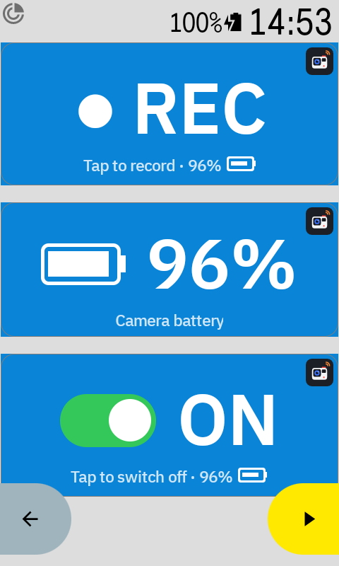
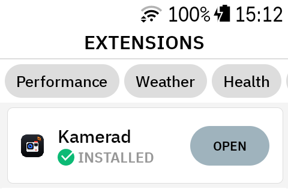
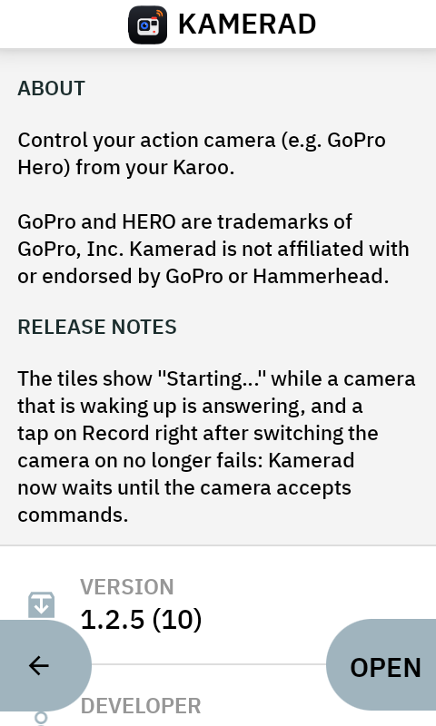
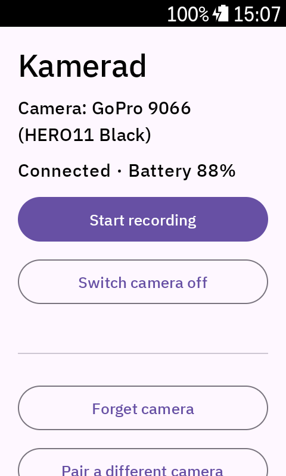
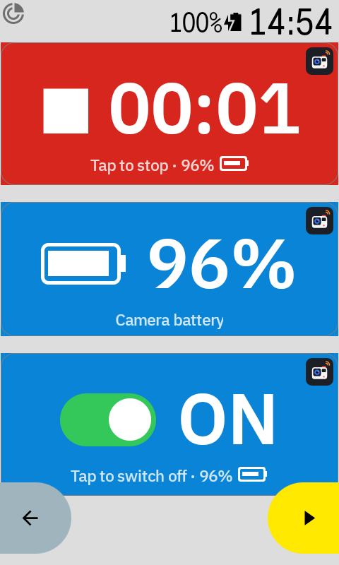
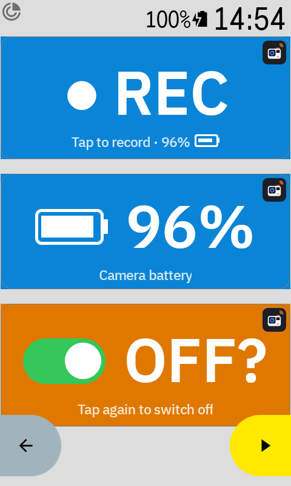
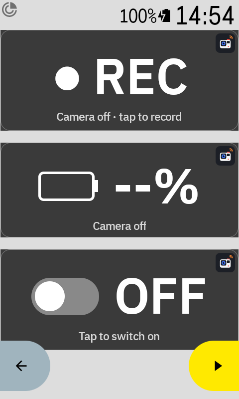
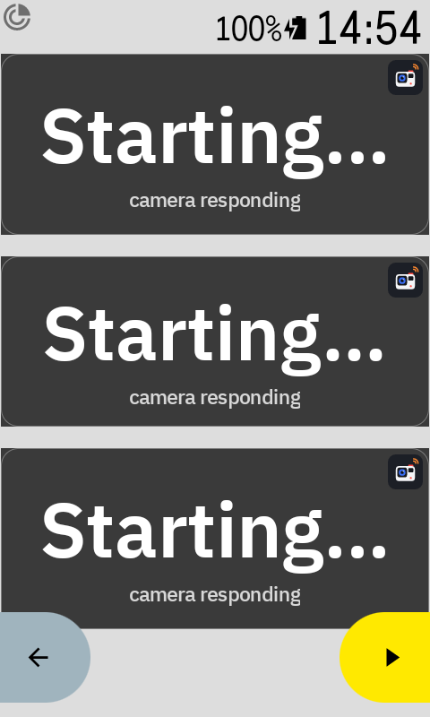

# Kamerad

Control your **GoPro** from your **Hammerhead Karoo**: start and stop recording, switch the camera on and off, and see its battery, all with big tiles on a data page.

**Website: [tellioglu.at/kamerad](https://tellioglu.at/kamerad/)**

<p align="center">
  
</p>

## What you get

Three tiles for your data pages:

| Tile | What it does |
|---|---|
| **Camera Record** | Tap to start recording. Tap twice to stop. Shows the recording time. |
| **Camera Battery** | Shows the camera's battery level. |
| **Camera On/Off** | Tap to switch the camera on. Tap twice to switch it off. |

There is also an action, **Camera start/stop recording**, for buttons that can start extension actions.

**Kamerad is deliberately simple.** It does these few things and nothing else. If you want more features, such as recording automatically with your ride, highlight markers, photo mode, video settings or SD card status, have a look at **[ClipRide](https://github.com/yrkan/clipride)**, a more full-featured open-source GoPro extension for the Karoo.

## What you need

- A Hammerhead Karoo (tested on a Karoo 3)
- A GoPro HERO9 or newer (tested with a HERO11 Black). A HERO8 works too, but it cannot be switched *on* from the Karoo: use its own button.
- Your phone with the Hammerhead Companion App to install the app once (or a computer with `adb`, see below)

## Install

### Without a computer: use your phone

No developer mode needed. This is Hammerhead's way to install an app that is not in the Karoo's extension library.

1. On your phone, **share the link** `https://tellioglu.at/kamerad/kamerad.apk` to the **Hammerhead Companion App**. For example, on the [website](https://tellioglu.at/kamerad/) touch and hold the **Download** button and choose *Share link*.
2. The Karoo downloads the file itself and shows an **Install** screen. Tap **Install**.

According to Hammerhead you need Karoo software 1.538.2049 or newer, the Companion App 1.36.0 (Android) or 1.12.0 (iPhone) or newer, the Karoo on Wi-Fi and a phone with internet. Hammerhead says that sharing a link only works on the newer Karoo (we tested it on a Karoo 3). Details: [Hammerhead's sideloading guide](https://support.hammerhead.io/hc/en-us/articles/31576497036827-Companion-App-Sideloading).

**Sharing the file instead:** you can also download `kamerad.apk` on your phone and share the file. Then make sure the download has finished and that it is the newest file. Your phone uploads the file first, and an incomplete or old copy makes the Karoo show "Unknown error". Sharing the link avoids this.

### With a computer: adb

1. Download [kamerad.apk](https://tellioglu.at/kamerad/kamerad.apk).
2. On the Karoo: **Settings → About**, tap **Build number** 7 times. Then **Settings → Developer options → USB debugging** on.
3. Connect the Karoo to your computer with a USB-C cable and run (`adb` is part of Google's [platform-tools](https://developer.android.com/tools/releases/platform-tools)):

   ```
   adb install kamerad.apk
   ```

Either way, Kamerad now appears under **Extensions** on the Karoo.

<table>
  <tr>
    <td align="center"><br>Extensions list</td>
    <td align="center"><br>Kamerad's page</td>
  </tr>
</table>

## Set up

1. On the Karoo open **Extensions → Kamerad → Open** and allow Bluetooth.
2. Put the GoPro in pairing mode: swipe down, then **Preferences → Wireless Connections → Connect Device → GoPro Quik App**.
3. In Kamerad tap **Search for cameras**, then tap your camera in the list.
4. Add the tiles: **Profiles →** your profile **→ Data pages →** a page **→ ADD FIELD → Kamerad**, and choose the tiles you want.

<p align="center">
  
</p>

## Using the tiles

<table>
  <tr>
    <td align="center"><br>Ready</td>
    <td align="center"><br>Recording</td>
    <td align="center"><br>Confirm</td>
    <td align="center"><br>Camera off</td>
    <td align="center"><br>Starting</td>
  </tr>
</table>

- **Blue:** the camera is on and ready. Tap **REC** to start recording.
- **Red:** recording. Tap twice to stop. The first tap turns the tile orange ("STOP?"), the second tap within 4 seconds stops.
- **Orange:** waiting for your second tap. Switching the camera off works the same way (and stops a running recording first).
- **Grey:** the camera is off, or Kamerad is waiting for it. Tap **REC** or the switch to wake it up. This takes a few seconds: first "Waiting…", then "Starting…".

## Good to know

- Kamerad only connects to the camera while a tile is on screen or the app is open, so the camera can go to sleep otherwise.
- Tiles in half-width fields show less text (no battery level).
- After you switch the camera off with Kamerad, it stays off until you switch it on again with Kamerad (or start a recording from the tile).

## For developers

Build instructions and code layout: [docs/DEVELOPING.md](docs/DEVELOPING.md).

## License

[MIT](LICENSE). Kamerad is built on Hammerhead's [karoo-ext](https://github.com/hammerheadnav/karoo-ext); see [THIRD-PARTY-NOTICES.md](THIRD-PARTY-NOTICES.md).

GoPro and HERO are trademarks of GoPro, Inc. Kamerad is not affiliated with or endorsed by GoPro or Hammerhead.
